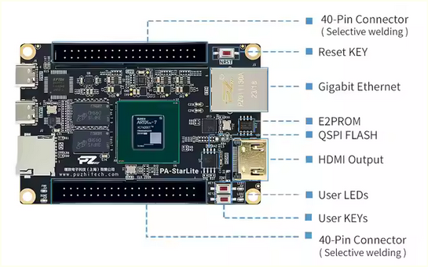
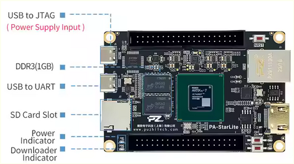
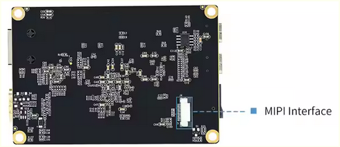
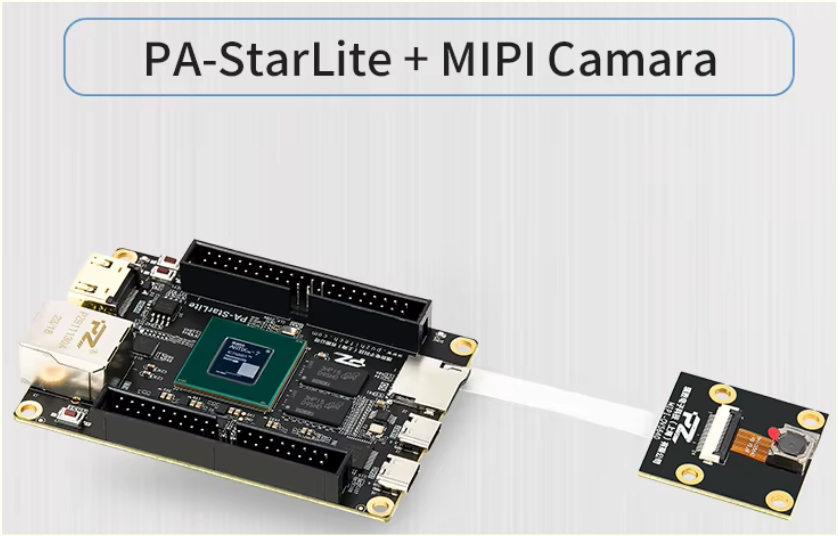
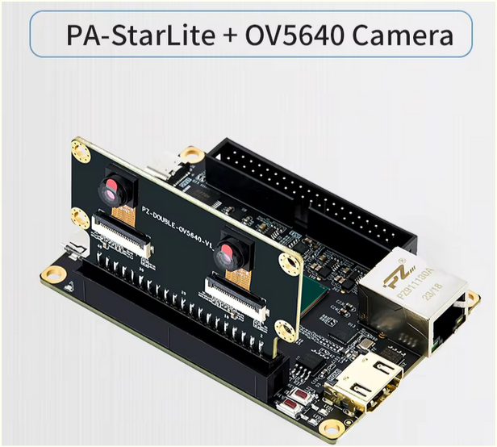
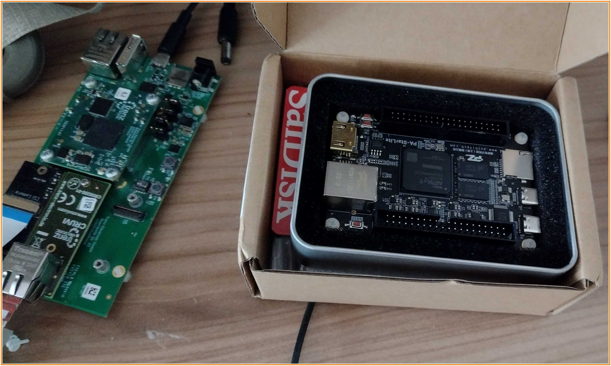
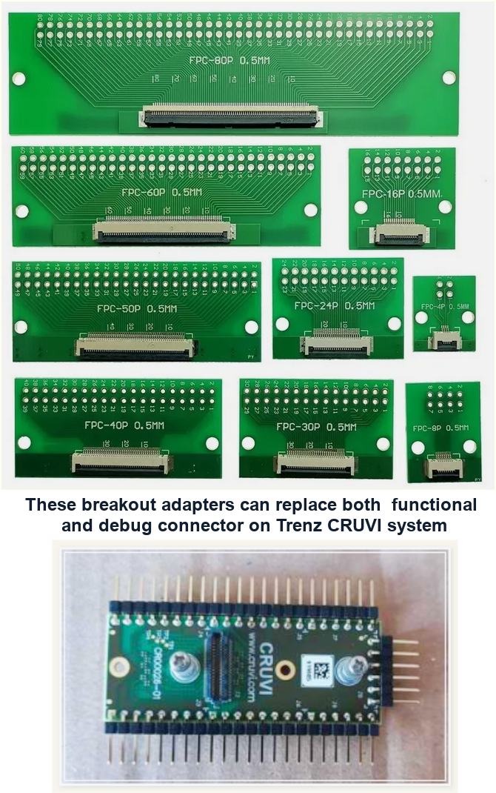

# Phase1 - openEye/CamSI

   

## Objective I
### Upgrade openCam Performance and Functionality
The goals of this development are to deliver complete video pipeline for three popular hi-rez imaging/camera sensors:
 - `2-lane RPiV2.1`, based on Sony IMX219, in `1280x720P@60Hz` RGB888 - `HD`
 - `4-lane OneInchEye`, based on Sony IMX283, in `1920x1080P@30Hz` RGB888 - `FHD`
 - `2-lane OV2740`, in a "Webcam" setup for Lukas Henkel's [openLaptop](https://resources.altium.com/p/open-source-laptop-part-one)

This is for mature, low-cost **Artix7 FPGAs**, by using its **IBUFDS, IDELAY, ISERDES** primitives in the camera front-end. These primitives are available in all IOBs, hence ubiquitous, relatively easy to work with, and already supported by opensource PNR for Xilinx Series7. This also allows future reduction of the total solution cost by migrating to [Spartan7](https://www.xilinx.com/video/fpga/spartan-7-technical-overview.html?_ga=2.252819658.271111311.1715447274-1421952438.1715447272), which does not have GTP transceivers (aka "true SerDes").

>To be clear -- We don't plan on using any of the 3rd party D-PHY front-end silicon devices specified in [XAPP894](https://github.com/chili-chips-ba/openeye-CamSI/blob/main/0.doc/Xilinx/MIPI/xapp894-d-phy-solutions.pdf). Moreover, we won't even use the passive signal conditioning networks that Xilinx is recommending. Instead, our objective is to achieve robust *Signal Integrity* (SI) and flawless HD/FHD video flow by pulling-in only on-chip resources.

This brings about multiple challenges. Compared to [StereoNinja's](https://github.com/StereoNinja/StereoNinjaFPGA) original work, which was for LatticeSemi ECP5 FPGA, our target device does not come with D-PHY receiver circuit *(no wonder why Artix7 costs less* :innocent:*)*.

On top of it, we are doing it on meager internal-to-FPGA BRAM budget, without expending much storage. In other words, PSRAM, SDRAM, DDR or similar external chips are NOT called to rescue. That's a major upgrade to StereoNinja's design, who realized end-to-end, camera-to-monitor streaming for only 640x480 VGA, and only in Grayscale, far below our vibrant RG888 color palette and HD/FHD quality. 

>This design is simpler and more affordable, hence uniquely appealing to the makers. It also paves a path to a cost-efficient openLaptop camera subsystem.

It is indeed the NLnet's objective for this project to bring StereoNinja's pioneering work to an order of magnitude higher performance and functionality level.

On the video feed sink side, we plan to showcase real-time streaming to:
 - **HDMI** monitor
 - **1Gbps Ethernet**, using UDP packets, rendered on a PC with [VLC Player](https://www.videolan.org)

The follow on "Webcam" project (aka Phase2) is to add **UVC** (USB2.0 Video Class) to this list. In prep for this future work, we plan to develop a number of add-on functions:
 - `Enable OV2740 camera chip`
 - `Image Signal Processing (ISP) 4 Webcam`
    > White Balance, Color Correction, Gamma Correction
 - `Video Compression 4 Webcam` - JPEG
    > Not needed for 1GE. But, compression is a must-have for the 1024P@30Hz over USB2

While our design is pushing Artix7 to its limits, it's these very silicon limits that stand in the way of getting more from the given imaging sensors. Recall that even StereoNinja's generally faster and better LatticeSemi FPGA cannot generate HDMI at 1920x1080@60Hz. 

Using Vivado tool chain, we were able to bring this design to the point where the only remaining factor preventing further resolution increase is the *Max Specified Toggle Rate* for Artix7 I/O structures and clock distribution networks.

## Objective II
### Add to opensource ecosystem 4 Xilinx

We are thrilled to use [openXC7](https://github.com/openXC7) toolkit, including its web-based CI/CD flow. That's both for the security of images taken, and to help openXC7 attain the level of robustness found in commercial / proprietary CAE tools, Xilinx Vivado in particular. In that sense, OpenEye-CamSI is the continuation of our [TetriSaraj](https://github.com/chili-chips-ba/openXC7-TetriSaraj), which was the first openXC7 test case for a design more complex than a mere blinky. 

>Our goal is to bring to the light issues that arrive from openXC7's first-ever exposure to demanding, cutting-edge designs like this one. 

It is important to note that, in its current state, openXC7 is rather immature, without even the basic timing awareness, yet alone timing-driven optimizations. It has never been used for designs that push the underlying silicon to the max. The as-is openXC7 is simply not adequate for proper timing closure.

While another project is underway and looking to plug this major opensource STA gap, it won't be ready for our Phase1. We're therefore planning Phase2 and Phase3, hoping to try this new timing closure prowess... Stress-testing, congesting, overwhelming it, all for the sake of making it more amenable to realizing higher Utilization and Fmax metrics with silicon at hand. 

The choice of our development platform was governed by the benefit for the greater community. The boards were selected for their opensource [CRUVI](https://github.com/micro-FPGA/CRUVI/blob/master/docs/CRUVI_Specification.pdf) connectivity spec. Yes, they are hardly used and don't come with support collateral found on the more popular hardware platforms. That's exactly why we opted for them!

We have indeed come across quite a few board problems and idiosyncrasies, spending a fair amount of time chasing issues that simply should not have been there. Still, since those are both opensource and EU products, this extra effort was for a good cause. We are certain that this project will help increase their visibility, and boost their acceptance rate among open makers. 

## Execution Play 1
### Laying a foundation
- [x] Familiarize with [Trenz](https://github.com/chili-chips-ba/openeye-CamSI/tree/main/0.doc/Trenz) hardware platform: Connectivity, clocking, power, etc. 
- [x] Bring up Blinky on Trenz
>___
- [x] Standalone HDMI image generation: 1280x720P@60Hz  RGB888 (HD)
- [x] Standalone HDMI image generation: 1920x1080P@30Hz RGB888 (FHD@30Hz)
- [x] Standalone HDMI image generation: 1920x1080P@60Hz RGB888 (FHD@60Hz). Established that FHD@60Hz is physically impossible with given silicon
>___
- [x] Experiments with IMX219 configuration and resolution options
- [x] Sniff Raspberry Pie interactions with Camera
- [x] Familiarize with *libcamera* drivers
>___  
- [x] Experiments with LVDS and termination schemes.
      How to do better than XAPP894, sharing insights with Lukas
>___
- [x] Test opensource [4-lane adapter](https://github.com/chili-chips-ba/openeye-CamSI/tree/main/0.doc/CRUVI-camera-adapter), sharing feedback with Edmund
- [x] Full redesign, fixing [bugs](https://github.com/chili-chips-ba/openeye-CamSI/blob/main/0.doc/CRUVI-camera-adapter/Technical-Note.TN-mipi.REV1.pdf) and expanding scope, to now include 2 and 4 lanes
>___
- [x] Clock Detection logic without standard LP I/O
- [x] SYNC Decoding logic and Byte Alignement
- [x] Word Alignement
- [x] Header Decoding and Stripping
- [x] Acquire static image from Camera, transfer it to DualPort BRAM, then HDMI
>___
- [x] Uncovered & debugged crosstalk problems on VHDPlus CRUVI adapter
- [x] Found Trenz [signal inversions and inconsistencies](https://github.com/chili-chips-ba/openeye-CamSI/blob/main/0.doc/CRUVI-camera-adapter/CRUVI-Pinout-4-and-2-lanes.xlsx), then shared with Antti
>___
- [x] HD video transfer from Camera to HDMI - At first jerky, with visible frame loss
- [x] Found CDC bug in opensource AsyncFIFO, sharing insights with IP owners
>___
- [x] Debayering logic for Color Space Conversion     
- [x] Synchronization logic for smooth video streaming, w/o external storage
>___

For this first play, the hardware was used in the following config:
- Trenz Carrier Card (TEB0707-02)
- Trenz 4x5 SoM with Artix-7 FPGA (TE0711-01)
- VHDPlus HDMI + 2-lane CSI Camera adapter
- Raspberry Pi V2.1 camera (Sony IMX219)

  

#### *Standalone HDMI image generation*
Our HDMI [image generator](https://github.com/chili-chips-ba/openeye-CamSI/tree/main/1.hw/lib/ip/hdmi) is limited by the toggle rate that's realistically possible with Artix7 clock and I/O primitives. The max we can get from it is:
- 720P@60Hz
- 1080P@30Hz
  
More about this and silicon limitations in [HDMI issue](https://github.com/chili-chips-ba/openeye-CamSI/issues/1#issue-2278453405). Here is the test image that our HDMI RTL outputs on its own, w/o camera connected to it:

  

#### *I2C for Camera Configuration*
There are many configurable registers in the IMX219 imaging sensor. Having fully familiarized with them, both by sniffing RPi I2C transactions and running own experiments, we've settled on the 720P@60Hz. I2C Controller was developped from the scratch, and used to load camera registers. More on it in [I2C issue](https://github.com/chili-chips-ba/openeye-CamSI/issues/3). 

Here is an illustration of I2C waveforms, i.e. our Control Plane protocol.

  

#### *Camera Connection*
Sony [IMX219](0.doc/Sensor.2-lane.RPi2.1/IMX219PQ.Datasheet.pdf) camera sensor is used for image acquisition. It is connected to FPGA with a 15-pin flex cable (FFC), using [VHDPlus](https://vhdplus.com/docs/components/camera) CRUVI module. We recommend checking our [blog](https://www.chili-chips.xyz/blog/untwisting-rpi5-camera-connectivity) for additional detail on this topic.

It turned out that the 4-lane CRUVI connector had a serious design flaw, essentially shorting system power. Having identified its root cause, we had to fully redesign it. We have also run into Trenz I2C wiring and supply complications related to onboard CPLD. Luckily, we managed to find a way around it without having to open the CPLD and change its internals.

#### *High-speed Signaling and Signal Integrity*
The VHDPlus CRUVI carries three 100 Ohm termination resistors, one for clock, plus two for data, as shown below: 

  

  
Location of these resistors close to data source is a major SI problem. Termination must be placed at the end of *Transmission Line* (TL), next to sink. Yet, on this system, the termination is not only misplaced, but there are also three connectors in the path of high speed signals:
- Camera to CRUVI -> `that's where the stock termination is placed`
- CRUVI to Carrier Card
- Carrier to FPGA SOM Card.

Consequently, we had to remove the stock termination and replace it with internal-to-FPGA resistors, so essentially relocating it to the very end of TL.

When Artix7 internal termination is used in connecton to LVDS_25 IOSTANDARD, it is important to set the correspoding bank's VCCIO to 2.5V. Only then will their differential resistance be 100 Ohms. 

That's on Trenz hardware done in the following way:
- switch DIP 2 to ON state, to set the IOV to 2.5V
- use Jumpers J14, J16, and J17 to connect VCCIO to IOV.
 
#### *Detection of Camera Clock Activity Intervals*
Once all these hardware and board problems were put behind, we turned focus back to RTL design. 

Given the goal to minimize overhead and eliminate the need for LP pins (see XAPP894), RTL had to provide a clever substitute for our non-existent I/O compared to standard Camera Serial Interface. After some experimentation, we settled on a scheme that detects blanking intervals between frames by using *Clock_Lock_FSM* with thresholds and timeouts. The output of this *Clock_Lock_FSM* is then used as global reset for the camera side of pipeline. That's to say that the video pipeline is out of reset only when camera clock is active and stable.

#### *CDC and Video Synchronization*
To have fluid and seamless video, we need to pass Pixel data with Line and Frame synchronization pulses from Camera to HDMI clock. Aiming for low-cost solution, this *Clock Domain Crossing* (CDC) and *Timebase Handoffs* are accomplished using Line Buffering instead of full Frame Buffering, so saving storage resources. More on this topic in [Line buffering issue](https://github.com/chili-chips-ba/openeye-CamSI/issues/2).

In addition to AsyncFIFO for **csi_clock->hdmi_clock** CDC, the signals that play crucial role in the *Timebase Handoffs* process are:
- csi_line_in
- hdmi_line_in

They mark the beginning of each new scan line in incoming video from Camera, as well as outgoing line to HDMI.

Furthermore, Async FIFO is kept in reset when either Camera or HDMI are Out-Of-Frame. It is through this **fifo_areset_n** and **hdmi_reset_n** that we are forcing HDMI to track the Camera. **rgb2hdmi** is the bridge between Camera and HDMI+GE worlds. Timing diagram below contains additional detail.

  

In all honesty, it took us a bit of trial-and-error to get it right. That was to some extent due to CDC bug we found in the fullness count of AsyncFIFO, which is the IP block we pulled from one of the opensource libraries. 

In the end, when everything was tuned, and AsyncFIFO CDC problem factored out of the solution, the final result came to be as nice and polished as follows:

#### *Clock and Block Diagram*

The following diagram illustrates design clocking scheme and block structure:

  

 
Design operates off of a single **external 100MHz** clock, from which we generate **200MHz refclk** for IDELAY and detection of camera activity. The camera clock comes in two forms:
- **CSI Bit** clock, for sampling and capturing incoming DDR data
- **CSI Byte** clock (= Bit clock / 4) for the rest of CSI video pipeline

The frequency of camera *Bit* and *Byte* clocks is the function of sensor resolution. A PLL on HDMI side generates two specific clocks from the common 100MHz input:
- **Parallel**, for RGB888 HDMI data
- **Serial**, (x5) for OSERDES and transmission of multiplexed video to monitor

The frequency of these two clocks is the function of HDMI resolution. We provide Verilog macros in the central *`top_pkg.sv`* for selection of HDMI resolution. 

The datapath is a straight video pipeline with option for width scaling via `NUM_LANE` parameter, which is also located in the central *top_pkg.sv*. 

The pipeline starts with circuits for capturing serial *Double Data Rate* (DDR) camera stream, eye-centering it using IDELAY, converting it to paralell format with ISERDES, then searching for *Byte boundaries*, followed by *Word alignement*, followed by *Packet Header* parsing and extraction of video *Payload* pixels.

It is only at this point, where video is *unpacked*, that we may engage in ISP. The ISP is a set of functions that could be as elaborate as one is willing to invest in them. Here is a [good read on it](https://www.eecs.yorku.ca/~mbrown/ICCV19_Tutorial_MSBrown.pdf). The extent of ISP for this project is clearly defined. The future Phase2 and Phase3 would add more. 

*Debayer* is the first ISP function we implemented. Without it, the displayed colors would have looked weird. More on it in [Debayer issue](https://github.com/chili-chips-ba/openeye-CamSI/issues/4).

## Execution Play 2
### Widening up the pathway
- [ ] Repeat the same for the 4-lane IMX283 camera sensor
- [ ] Step-by-step introduce the following 3 ISP elements:
> - [x] Debayer [ ] Manual Exposure Control [ ] Dead Pixel Management
- [ ] Implement another (lower) resolution of our choice

## Execution Play 3
### Ethernet streaming
- [ ] Add 1GE as second video sink, then move display to remote PC, via UDP VLC
- [x] Document implementation via block diagram and project repo

## Execution Play 4
### Porting to openXC7
- [ ] Port final design from Vivado to openXC7
- [x] Simulate it with Verilator and cocoTB, in CI/CD system
- [ ] Document scripts and flows used in this process

## Execution Play 5
### Prepping for Webcam
- [ ] Enable OV2740 camera chip
- [ ] Add 3 new ISP functions
> - [ ] White Balance [ ] Color Correction [ ] Gamma Correction
- [ ] and JPEG video compression

## Trenz and CRUVI in retrospect

The hardware platform originally selected for this project proved to be a capital miss and source of most of our troubles. 

We ended up having to debug board and connectivity issues on PCBAs that no one used before, or combinations thereof that the manufacturer never tested. Be it incorrect termination resistors, straight shorts, cold solder joints and opens on flaky connectors, signal integrity degradation from too much modularity / discontinuity on the path, swaps of differential pairs, or wiring high-speed clocks to the non-Clock Capable (CC) FPGA pins, the share of board issues we had to deal with was overwhelming.

On top of that comes scarce availability of Trenz board, with lead times in excess of three months for a simple passive CRUVI Debug Card. All that has cost us dearly in time and effort. Yes, CRUVI is open-source. Yes, Trenz is European. But, we cannot afford to keep investing and loosing so much in order to support that cause.

Going forward, we are parting away with Trenz CRUVI system, and switching to Puzhitech [PA-StarLite](https://www.aliexpress.us/item/3256806434967523.html?gps-id=pcStoreJustForYou&scm=1007.23125.137358.0&scm_id=1007.23125.137358.0&scm-url=1007.23125.137358.0&pvid=c1d02f3c-8f66-4b76-a24a-a72144960d79&_t=gps-id%3ApcStoreJustForYou%2Cscm-url%3A1007.23125.137358.0%2Cpvid%3Ac1d02f3c-8f66-4b76-a24a-a72144960d79%2Ctpp_buckets%3A668%232846%238107%231934&pdp_npi=4%40dis%21USD%21128.44%21102.75%21%21%21901.32%21721.06%21%402101c67a17281960440137763ec377%2112000037845115402%21rec%21US%212013047485%21XZ&spm=a2g0o.store_pc_home.smartJustForYou_2010082555490.1005006621282275&gatewayAdapt=glo2usa). This compact card brings everything we need for video projects off-the-bat, within basic package, including 2-lane MIPI CSI connector, HDMI output and 1Gbps Ethernet. No need for multiple add-on cards and connectors to put together a useable system that's 3x more expensive, more fragile, and not in stock.

This card also comes with solid expension potential via two 40-pin standard 100mil headers. They are mechanically robust, physically accessible for debugging, and still can carry relatively high-speed signals thanks to short, balanced wiring on the mainboard.

   

   

While [Puzhitech](http://www.puzhitech.com/en) board already comes with 15-pin 0.5mm FPC for 2-lane MIPI CSI, the 40-pin 100mil headers can be used to hook up additional RPi cameras via its [15-pin 1mm](https://tinkersphere.com/cables-wires/3843-15-pin-05mm-1mm-pitch-fpc-to-dip-breakout.html#/soldered_side-1mm) FPC, as well as 22-pin 0.5mm connector for the 4-lane interface. Below is a picture of the [adapters](https://www.ebay.com/itm/175795228114?mkcid=16&mkevt=1&mkrid=711-127632-2357-0&ssspo=1cGlwdPqS5y&sssrc=4429486&ssuid=QKddZKcUTzu&var=475196039437&widget_ver=artemis&media=MORE) we used. We recommend fitting them with DIP connectors that have longer legs, so that they protrude on the bottom side, and also serve as attachment points for oscilloscope. That alleviates the need for the €36 Trenz Debug Connector and its impossibly long lead time of 3+ months.

# Phase2 - USB Webcam
- See: https://nlnet.nl/project/FPGA-ISP-UVM-USB2

# Phase3 - openCam/Event
- The project proposal is under construction

## *Acknowledgements*
We are grateful to:
 - NLnet Foundation's sponsorship for giving us an opportunity to work on this fresh new take at FPGA video processing.
 - StereoNinja, whose project has set the stage for this major upgrade of opensource camera performance and functionality, as well as its expansion from LatticeSemi to Xilinx ecosystem.

    
    

#### End of Document
